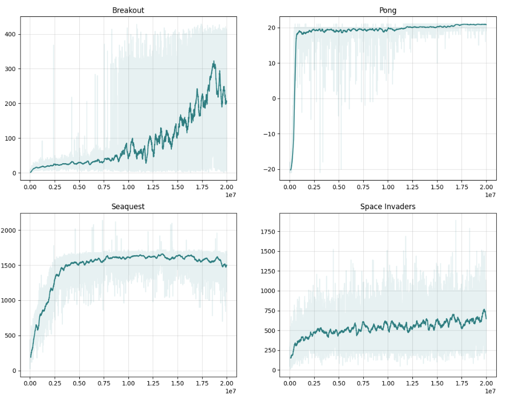
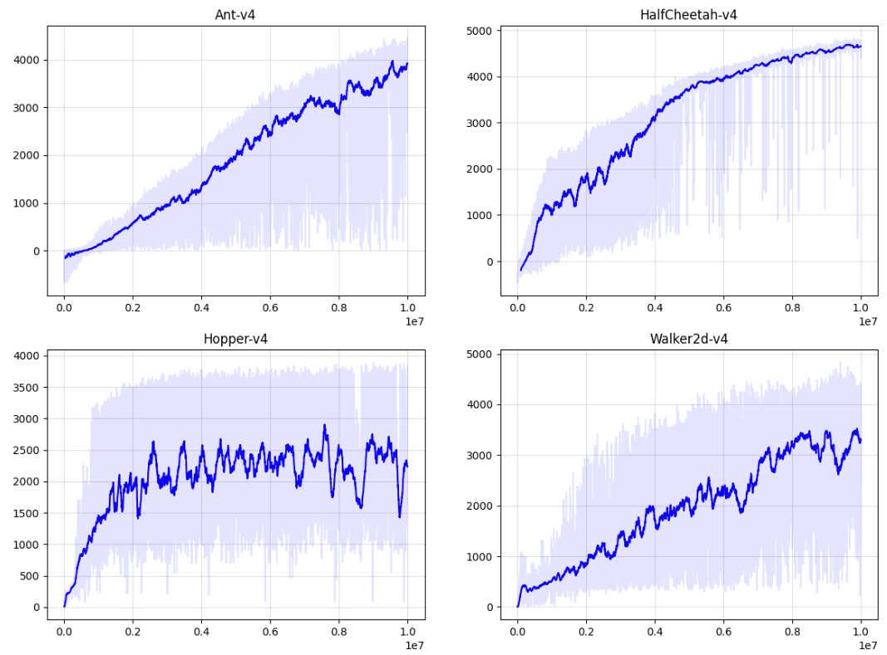

# PPO MPI Base

This is a base version of PPO that is meant as a starting point for algorithm modifications or as a simple implementation to use in research. It is refactored from spinning-up and includes some additional functionality here and there.

This work is authored by Ted Staley and is Copyright © 2025 The Johns Hopkins University Applied Physics Laboratory LLC, please see the LICENSE file.


## Major Update 4/22/2025

This repo now also supports centralized networks with vectorized environments as an alternative execution style. This has significant speed implications for larger networks (i.e. CNNs) which are best placed on the GPU. The examples now include running both styles for Atari and Mujoco (four examples total).

For reference, I see the following throughput on my machine, using a CNN for Atari (Pong) and a simple MLP for Mujoco (Antv4). MPI-based execution is significantly faster for the MLP, but significantly slower for the CNN:

- Atari (PongNoFrameskip-v4), 8 Environments, CNN:
  - Exec w/ MPI: ~600 fps
  - Vectorization: **~1,900** fps
- Mujoco (Ant-v4), 8 Environments, MLP:
  - Exec w/ MPI: **~6,000** fps
  - Vectorization: ~3,200 fps


**Additional Changes and Notes:**

- Two worker classes (for mpi and vectorized) stem from a common base class in worker_base.py
- gymnasium is now the preferred interface rather than gym
- kwargs can be passed through to the environment (mpi only), policy, or value network for additional customization
- support for gradient accumulation
- For mpi execution, the device must be None (i.e. should not place networks on GPU)
  - While this is technically possible (each process uses 1/Nth of the GPU), it is awkward and probably more trouble than it is worth.
- For vectorized environments, some additional constraints stem from gymnasium's AsyncVecEnv wrapper:
  - env_kwargs are not supported
  - max_ep_len must be None, and should instead be enforced with gymnasium.wrappers.TimeLimit


## Installation

Requires torch, tensorboard, mpi4py, numpy, scipy, and gymnasium.

Most of these can be pip-installed. To install mpi4py I recommend conda-forge:
```
conda install -c conda-forge mpi4py
```

Then install this repo with:
```
pip install -e .
```

Note: It is worth trying a few different MPI implementations to see which is best on your system.


## Example Usage

See ```train.py``` in each of the examples. In general, you need to define three methods and pass these to ppo_mpi_base.ppo.PPO():

- A method that builds and returns an environment instance, applying all wrappers, etc
- A method that builds and returns a policy network
- A method that builds and returns a value network

Together these give a great deal of flexibility over the experiment (along with many hyperparameters you can set). You then run this file using MPI:

```mpiexec -n 8 python train.py```


## Changes from Spinning-Up

- Refactored to separate the high-level algorithm (ppo.py) from the lower-level details (worker.py). I find this useful if I want to hack at the algorithm. It is also easier to "see" the big picture this way. But there are more files now.
- Can pass in arbitrary networks for policy and value function (i.e. CNNs)
- Added entropy loss option
- Supports gymansium
- Decoupled rollout length from max episode length
- Decoupled rollout length from batch size
- No longer supports coupled policy-value networks
- A few minor things: 
  - Logging to tensorboard
  - Model saving triggered by new performance best
  - Estimated FPS and time remaining printouts


## Results on Selected Environments (2024, MPI-Only)

### Atari
**examples/atari/**

Requires atari: ```pip install gymnasium[atari], pip install gymnasium[accept-rom-license]```. These environments proved quite challenging to solve as there are lots of details in the wrapping of the environment and hyperparameters. The current settings work alright but do not match PPO's reported results. These ran for 20M steps in an attempt to reach better performance.

Additionally, these runs use the "NoFrameskip-v4" environments over the "ALE...v5" environments.



For comparison, the original PPO paper reports scores of 274.8, 20.7, 1204.5, and 942.5 for Breakout, Pong, Seaquest, and Space Invaders, respectively.

### Mujoco

**examples/mujoco/**

Requires mujoco: ```pip install gymnasium[mujoco]```. These are much more stable than the Atari environments above. However, if attempting these types of problems SAC is probably much more performant.



For comparison, the original PPO paper reports scores of around 1800, 2250, and 3000 for HalfCheetah, Hopper, and Walker2d respectively. They used the v1 environments and did not include Ant.

